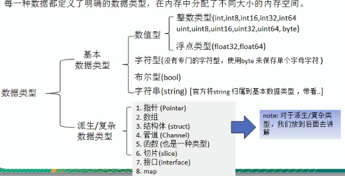
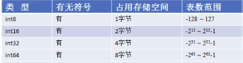
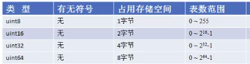

## 代码结构

基本结构

```go
package main // 每一个Go文件都必须属于一个包

import "fmt" // 导入不多说

func main() { // 函数声明, 并且每一个文件都要有一个 main() 函数
    fmt.Println("Hello World") // 字符串必须双引号
}

// others
```


## 变量

Go 语言是静态语言, 声明变量必须声明类型

```go
var str1 string = "Jeden"
var num1 int = 12
var non string // 如果只声明没有赋值的话, Go会用默认值 字符串为空,数字为0,布尔为false
var noType = "str" // 如果未声明类型, Go会判断值,并自动生成类型(只有一次)
simple := "simple" // 相当于 var simple string = "simple" // 不能用于已声明的变量(二次声明)

// 一次性声明多个变量
var a, b, c, d int // 多个int类型的变量(只能有一个类型)

// 解构赋值
var a, b = 100, "jeden" // 不能有类型

// 在main函数上面(之外)的是全局变量
```

### 数据类型



#### int



##### 正数



#### 字符串

#### 数组

#### 切片

#### 内存指针

### Map


## 数据类型转换

Go的数据类型转换不会像JS那样自动执行, 只能**显式转换**

```go
func main(){
    var n1 int32 = 122345
    var n2 float32 = float32(n1)
    var n3 int64 = float64(n1) // 低精度到高精度也需要转换
    fmt.Println("n1=%v, n2=%v, n3=%v", n1, n1, n3) // 模板字符串
}
```

表达式: `var n T = T(n1)`

- 可以从大范围到小范围, 也可以从小范围到大范围
- 转换不会更变原始值
- 如果范围有偏差, 比如int32转int8, 而且超出了int8的范围, 不会报错, 会按照溢出处理*以后研究结果*

##　函数


## 面向对象


## Redis

支持五大数据类型: String, Hash, List, Set(无序), Zset(有序)


